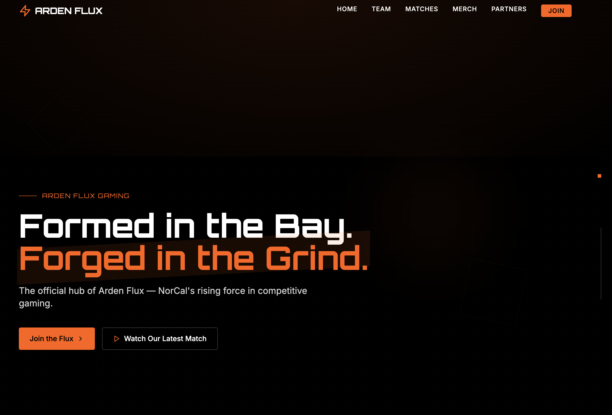

# Arden Flux Gaming Website

A modern esports team website concept designed and developed by **The Creative Pro**. Built with Vite + React + Tailwind CSS, this project showcases a fictional elite gaming team from the Bay Area, highlighting custom branding, match schedules, team roster, merch, and sponsor sections.

---

## 🔧 Tech Stack

- **Vite + React** — lightning-fast development environment
- **Tailwind CSS** — for utility-first styling
- **Framer Motion** — subtle animations and transitions
- **Heroicons / Lucide-react** — scalable icon system
- **Netlify** — deployed and hosted

---

### 🧠 Project Overview

This single-page app simulates the official site for Arden Flux, NorCal’s fictional top-tier esports organization. Includes sections for:

- Homepage Hero + CTA
- Team Member Bios
- Match Schedule
- Merch Drop
- Partners & Sponsorships
- News & Updates
- Join the Team
- FAQs

---

#### Homepage Hero

#### Meet the Squad

#### Join the Team + Partners

---
[Visit](https://arden-flux-gaming.netlify.app)

Project created by The Creative Pro
https://github.com/cpuncekar
